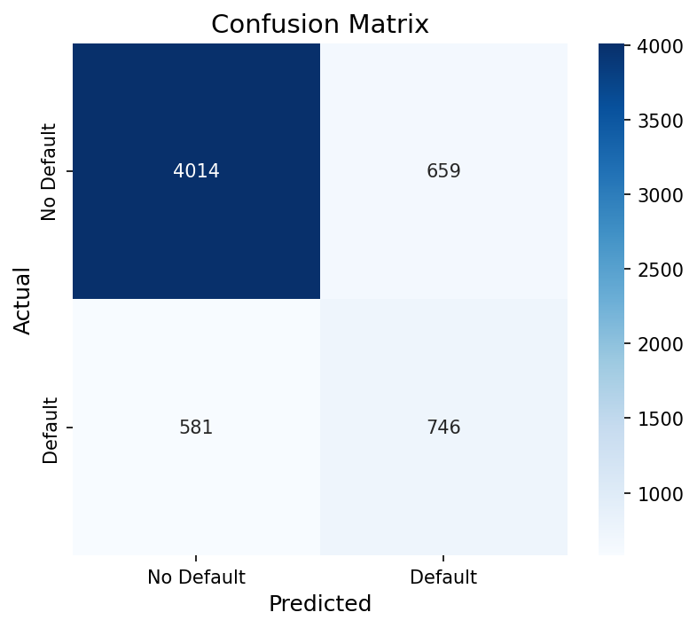
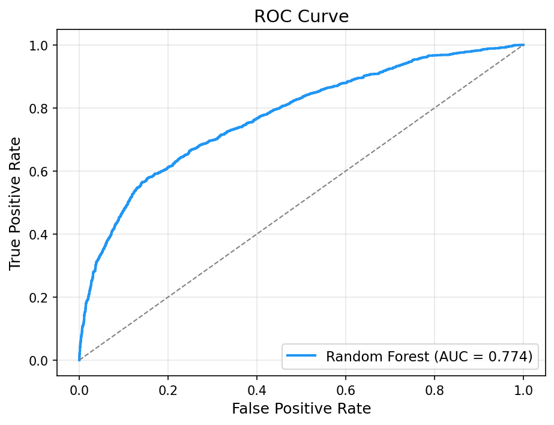
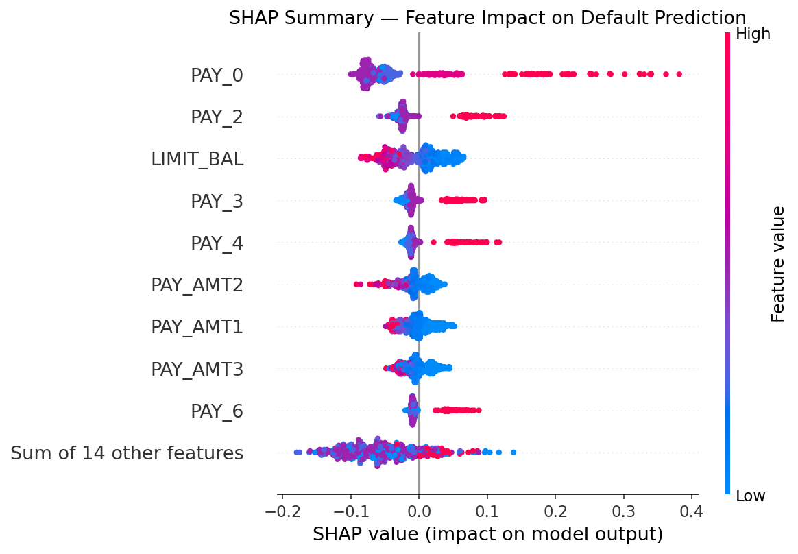
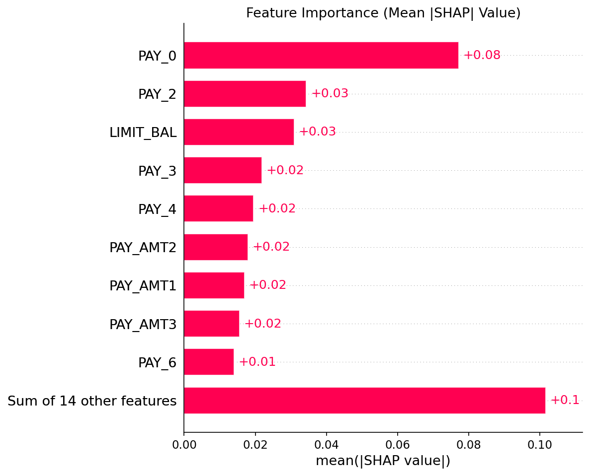
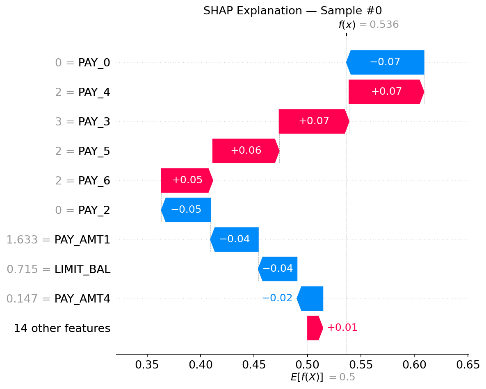

# Credit Card Default Prediction with Explainability

> A **portfolio-quality** machine learning project that predicts whether a credit card client will default next month, using a **Random Forest** classifier explained with **SHAP** (SHapley Additive exPlanations).


---

## 📌 Business Problem

Banks issue credit cards to millions of clients, but **predicting which clients will fail to make their next payment** is critical for managing portfolio risk and reducing bad debt.

This project builds an **interpretable** ML model that:

1. **Predicts** the probability of default for each client.
2. **Explains** the key drivers behind every prediction using SHAP.
3. Provides **actionable insights** for credit risk teams.

---

## 📊 Dataset Description

| Item | Detail |
|------|--------|
| **Source** | [UCI ML Repository — Default of Credit Card Clients](https://archive.ics.uci.edu/ml/datasets/default+of+credit+card+clients) |
| **Samples** | 30 000 clients |
| **Features** | 23 (demographic, credit, payment history) |
| **Target** | `default payment next month` (binary: 0 = No, 1 = Yes) |
| **Class split** | ~78 % No Default · ~22 % Default |

**Key features:**

| Feature Group | Columns | Description |
|---------------|---------|-------------|
| Credit | `LIMIT_BAL` | Individual credit limit |
| Demographics | `SEX`, `EDUCATION`, `MARRIAGE`, `AGE` | Client profile |
| Payment Status | `PAY_0` – `PAY_6` | Repayment status (Sept – Apr) |
| Bill Amount | `BILL_AMT1` – `BILL_AMT6` | Monthly bill statements |
| Payment Amount | `PAY_AMT1` – `PAY_AMT6` | Monthly payment amounts |

---

## 🗂 Project Structure

```
credit-default-xai/
│
├── data/
│   └── default_credit.csv          # Raw dataset
│
├── notebooks/
│   └── exploratory_analysis.ipynb   # EDA with rich visualisations
│
├── src/
│   ├── __init__.py
│   ├── utils.py                     # Shared paths, logging, helpers
│   ├── data_preprocessing.py        # Load → Clean → Scale → Split
│   ├── train_model.py               # Train & save Random Forest
│   ├── evaluate.py                  # Metrics + confusion matrix + ROC
│   └── explainability.py            # SHAP summary, importance, waterfall
│
├── outputs/
│   ├── plots/                       # All generated visualisations
│   └── models/                      # Serialised model (joblib)
│
├── requirements.txt
└── README.md
```

---

## ⚙️ Installation

```bash
# 1. Clone the repository
git clone https://github.com/<your-username>/credit-default-xai.git
cd credit-default-xai

# 2. Create a virtual environment (recommended)
python -m venv venv
source venv/bin/activate        # Linux / macOS
venv\Scripts\activate           # Windows

# 3. Install dependencies
pip install -r requirements.txt
```

---

## 🚀 How to Run

All scripts are designed to be executed from the `src/` directory:

```bash
cd src
```

### Step 1 — Data Preprocessing

```bash
python data_preprocessing.py
```

Loads the dataset, cleans it, scales numeric features, and performs an 80/20 stratified train-test split.

### Step 2 — Train the Model

```bash
python train_model.py
```

Trains a Random Forest (300 trees, max depth 12, balanced class weights) and saves it to `outputs/models/random_forest.joblib`.

### Step 3 — Evaluate

```bash
python evaluate.py
```

Prints accuracy, precision, recall, F1, ROC-AUC and saves:
- `outputs/plots/confusion_matrix.png`
- `outputs/plots/roc_curve.png`

### Step 4 — Explainability

```bash
python explainability.py
```

Generates SHAP-based plots and a plain-English interpretation:
- `outputs/plots/shap_summary.png`
- `outputs/plots/shap_feature_importance.png`
- `outputs/plots/shap_single_explanation.png`

### Notebook (optional)

```bash
cd ../notebooks
jupyter notebook exploratory_analysis.ipynb
```

---

## 📈 Model Performance

| Metric | Score |
|--------|-------|
| **Accuracy** | 0.7933 |
| **Precision** | 0.5310 |
| **Recall** | 0.5622 |
| **F1 Score** | 0.5461 |
| **ROC-AUC** | 0.7741 |

### Confusion Matrix

<p align="center">
  
</p>

### ROC Curve

<p align="center">
  
</p>

---

## 🔍 Explainability Insights

### SHAP Summary Plot

<p align="center">
  
</p>

### Feature Importance

<p align="center">
  
</p>

### Single Prediction Explanation

<p align="center">
  
</p>

### Key Findings

| # | Insight |
|---|---------|
| 1 | **PAY_0 (most recent repayment status)** is the single strongest predictor of default — a delay of even one month drastically raises the risk. |
| 2 | **Payment history features (PAY_2 – PAY_6)** collectively dominate: repeated late payments have a compounding effect on predicted risk. |
| 3 | **LIMIT_BAL (credit limit)** acts as a proxy for the bank's internal risk assessment; lower limits correlate with higher default probability. |
| 4 | **Bill and payment amounts** have moderate influence — large outstanding balances with low repayments push predictions toward default. |
| 5 | **Demographic features** (sex, education, marriage) have comparatively low importance, indicating the model relies on behavioural signals. |

---

## 📸 Screenshots

Place additional screenshots here after running the pipeline:

| Plot | Path |
|------|------|
| Target Distribution | `outputs/plots/target_distribution.png` |
| Correlation Heatmap | `outputs/plots/correlation_heatmap.png` |
| Credit Limit Distribution | `outputs/plots/credit_limit_distribution.png` |
| Age Distribution | `outputs/plots/age_distribution.png` |
| Default Rate vs Payment Delays | `outputs/plots/default_rate_vs_payment_delays.png` |
| Default Rate vs Credit Limit | `outputs/plots/default_rate_vs_credit_limit.png` |
| Confusion Matrix | `outputs/plots/confusion_matrix.png` |
| ROC Curve | `outputs/plots/roc_curve.png` |
| SHAP Summary | `outputs/plots/shap_summary.png` |
| SHAP Feature Importance | `outputs/plots/shap_feature_importance.png` |
| SHAP Single Explanation | `outputs/plots/shap_single_explanation.png` |

---

## 🔮 Future Improvements

- **Hyperparameter tuning** — use Optuna / GridSearchCV for automated optimisation.
- **Additional models** — compare with XGBoost, LightGBM for benchmark.
- **LIME explanations** — add local interpretable model-agnostic explanations.
- **Fairness audit** — assess model bias across demographic groups.
- **Deployment** — wrap the model in a FastAPI / Streamlit app for interactive use.
- **CI/CD** — add GitHub Actions for automated testing and linting.

---

## 📄 License

This project is released under the [MIT License](LICENSE).

---

<p align="center"><i>Built with ❤️ for learning, transparency, and responsible AI.</i></p>
